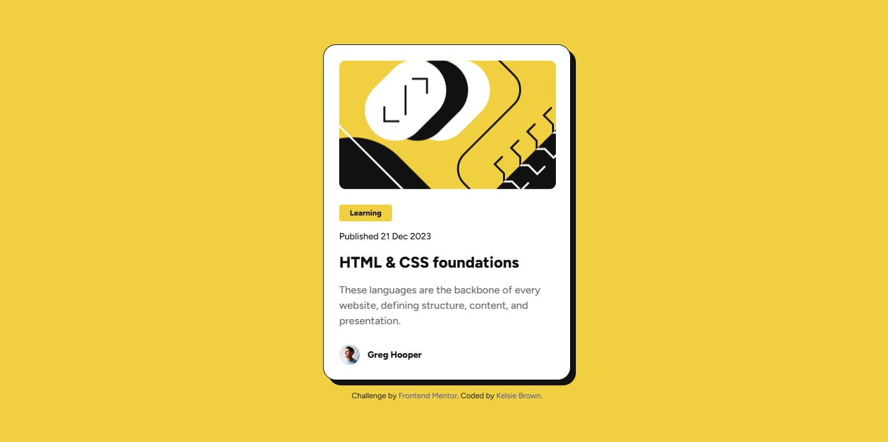

# Frontend Mentor - Blog preview card solution



This is a solution to the [Blog preview card challenge on Frontend Mentor](https://www.frontendmentor.io/challenges/blog-preview-card-ckPaj01IcS). Frontend Mentor challenges help you improve your coding skills by building realistic projects. 

## Table of contents

- [Overview](#overview)
  - [The challenge](#the-challenge)
  - [Links](#links)
- [My process](#my-process)
  - [Built with](#built-with)
  - [What I learned](#what-i-learned)
  - [Continued development](#continued-development)
  - [Useful resources](#useful-resources)
- [Author](#author)

## Overview

### The challenge

Users should be able to:

- See hover and focus states for all interactive elements on the page

### Links

- Solution URL: [Add solution URL here](https://your-solution-url.com)
- Live Site URL: [previewblogcard.vercel.app](https://previewblogcard.vercel.app/)

## My process

### Built with

- Semantic HTML5 markup
- CSS custom properties
- Flexbox
- Mobile-first workflow

### What I learned

While I chose not to utilize the font folder that came with the starter files, I still decided to learn more about them. I'm working on improving my time management when it comes to researching topics and concepts I don't know. I find I spend more time looking things up than I do actually coding the project. For example, this project took me 2 hours and 44 minutes to complete and of that, I spent 30-40 minutes actually coding. 

#### Variable Fonts
Unlike traditional fonts, variable fonts store all weight, width, and style variations in one file. They work with "axes," which are design parameters like weight, width, and optical size, and "instances," which are specific combinations of values on those axes. Designers can adjust these variations using CSS, creating diverse styles without multiple files. Variable fonts are ideal for responsive design, web applications, animation, print and digital design, and accessibility.

Examples of Axes: 
- Weight (light to bold)
- Width (spacing)
- Optical Size (optimize readability for different sizes and applications)   
- Slant (italic or oblique variations) 
- Custom Axes (unique variations)

Benefits of Variable Fonts:
- Smaller Files: One file holds many styles.
- Faster Pages: Fewer HTTP requests.
- Design Flexibility: More creative control.
- Readability: Optimized for all screens.
- Simplicity: Easier management of many styles.

### Continued development

- I'm going to:
  - Explore more of my curiousity into variable fonts. 
  - Learn more advanced git concepts and commands such as ```merge``` and ```rebase```. 

### Useful resources

- [Variable fonts](https://web.dev/articles/variable-fonts) - This article helped me understand variable fonts. It has lots of examples, videos, and diagrams on the topic. I recommend someone give it a read who wants to learn more about variable fonts.
- [Best practices for fonts](https://web.dev/articles/font-best-practices) - This article was great at teaching me the font lifecycle. It discusses font loading, font delivery, and font rendering and best practices for each.

## Author

- Website - [Kelsie Paige](https://kelsiepaige.github.io/portfolio/)
- Frontend Mentor - [@KelsiePaige](https://www.frontendmentor.io/profile/KelsiePaige)
- Twitter - [@Kelsie_Codes](https://x.com/Kelsie_Codes)
- LinkedIn - [Kelsie Paige](https://www.linkedin.com/in/kelsie-paige/)
